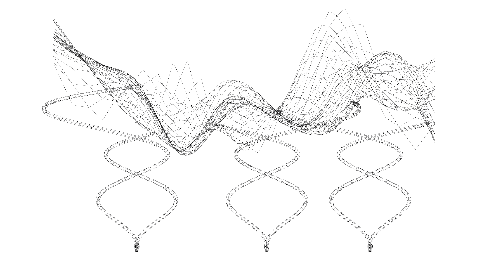

# Assignment 3: Parametric Structural Canopy Documentation

## Table of Contents

- [Pseudo-Code](#pseudo-code)
- [Technical Explanation](#technical-explanation)
- [Design Variations](#design-variations)
- [Challenges and Solutions](#challenges-and-solutions)
- [References](#references)

---

## Pseudo-Code

1. **Main Function: Generating the Canopy**

   - **Inputs**:
     - `parametric_surface`: Parametric surface, which incorporates size, depth and grid size.
     - `tessellation_strategy`: Diagrid tesselation.
     - `generate_recursive_supports`: parametric supports generated through recursion.

   - **Process**:
     - **Parametric Surface**:
       - input parameters and generate a surface
     - **Tessellate Surface**:
       - Divide the modified surface into a diagrid mesh.
     - **Generate Vertical Supports**:
       - Create supports using recursive geometry.

   - **Outputs**:
     - `canopy_mesh`: The tessellated canopy shell.
     - `supports`: The vertical support structures.

2. **Functions**

   - **`parametric_surface(length, width, min_height, max_height, n_cols, n_rows)`**
     - *Purpose*: Generate a surface parametrically with random height.
     - *Implementation Details*:
       - input length & width.
       - input number of collumns and rows in for the grid points. 
       - give each grid point a random height betweem minimum and maximum height.
       - generate a random organic surface.

   - **`tessellate_surface(surface, strategy)`**
     - *Purpose*: Tessellate the surface based on the chosen strategy.
     - *Implementation Details*:
       - input surface and the U & V subdivision.
       - generate diagrid.

   - **`generate_recursive_support(start_point, start_angle, angle_change, length, length_scale, height_step, surface, max_heigth):`**
     - *Purpose*: Generate recursive structures for supports.
     - *Implementation Details*:
       - Use recursion to create complex geometries.
       - Control recursion with these parameters  `start_angle`, `length`, `length_scale`, `height_step`, `surface` and `max_heigth`.

---

## Technical Explanation

For the Surface generation the focus was on creating a parametric surface with randomized height. It is 'build' to have input for the size and the desired resolution of the grid points. The number of gridpoints creatly dictate how smooth the surface is gonna be, as the more points, the more 'bumpy the surface. lastly the height is dictated by the min/max height input and will be randomly genrated at each gridpoint, thus generating an 3D surface. The recursive support are generated from a start point and has 5 parametric inputs which affects its recursive generation. The parameters are start angle, angle change, length, length scale and height step. The start angle is which direction the support will start heading in and angle change is how much the angle will change in increments for each recursion. The length is the length of the support in each recursion and length scale influence wether the length increases, decreases or stays the same during the recursions. lastly height step is how vertical the support expands for each recursion. I also wanted to add a n_support, which would generate more supports from the same start point, but I couldn't get it to work, so I instead used the same component, just with different start angle.
The tesselation is a quite simple diagrid, as I primarily focused on the 2 abovementioned parts. The parameters for the diagrid is the input surface generated and the U & V values.
Unsure about the last part about combinning them, think I may have misunderstood something, as I made each function to its own component and combinned them that way. 

## Design Variations

### Base Surface Shape Variations

1. **Variation 1: [Name/Description]**

   

   - **Parameters**:
     - `length & width`: [100]
     - `min_height`: [20]
     - `max_height`: [50]

2. **Variation 2: [Low_height_differenceme/Description]**

   

   - **Parameters**:
     - `length & width`: [100]
     - `min_height`: [30]
     - `max_height`: [35]

3. **Variation 3: [High_height_difference]**

   

   - **Parameters**:
     - `length & width`: [100]
     - `min_height`: [10]
     - `max_height`: [70]

4. **Variation 1: [low_U_&_Low_V]**

   

   - **Parameters**:
     - `U`: [10]
     - `V`: [10]

5. **Variation 2: [high_U_&_Low_V]**

   

   - **Parameters**:
     - `U`: [50]
     - `V`: [10]

6. **Variation 3: [low_U_&_high_V]**

   

   - **Parameters**:
     - `U`: [10]
     - `V`: [50]
7. **Variation 1: []**

   

   - **Parameters**:
     - `angle_change`: [30(degrees)]
     - `length`: [1]
     - `length_scale`: [1.1]
     - `height_step`: [2]

8. **Variation 2: [Name/Description]**

   

   - **Parameters**:
     - `angle_change`: [70(degrees)]
     - `length`: [4]
     - `length_scale`: [0.9]
     - `height_step`: [2]

9. **Variation 3: [Name/Description]**

   

   - **Parameters**:
     - `angle_change`: [30(degrees)]
     - `length`: [5]
     - `length_scale`: [1]
     - `height_step`: [2]

---

## Challenges and Solutions

- **Challenge 1**: Adapting scripts to Grasshopper.
  - **Solution**: I looked up videos, forums and AI to get a better understanding of these new kinds of issues that can arise and to troubleshoot list issues. 

- **Challenge 2**: Inputs & Outputs.
  - **Solution**: Getting an understanding of how and when to add inputs and outputs to grasshopper components to get the desired 'items' out from the functions (script).

- **Challenge 3**: Performance optimization.
  - **Solution**: I ran into issues with the recursive supports, where i set them to stop when either the length was to low or they intersected the canopy surface. But after i started experimenting with increasing the length_scale, issues arose when the support didn't intersect with the surface, as it would then have no limit and crash rhino. I workerd around this by adding a break if the height is equal the the max_height of the canopy.
